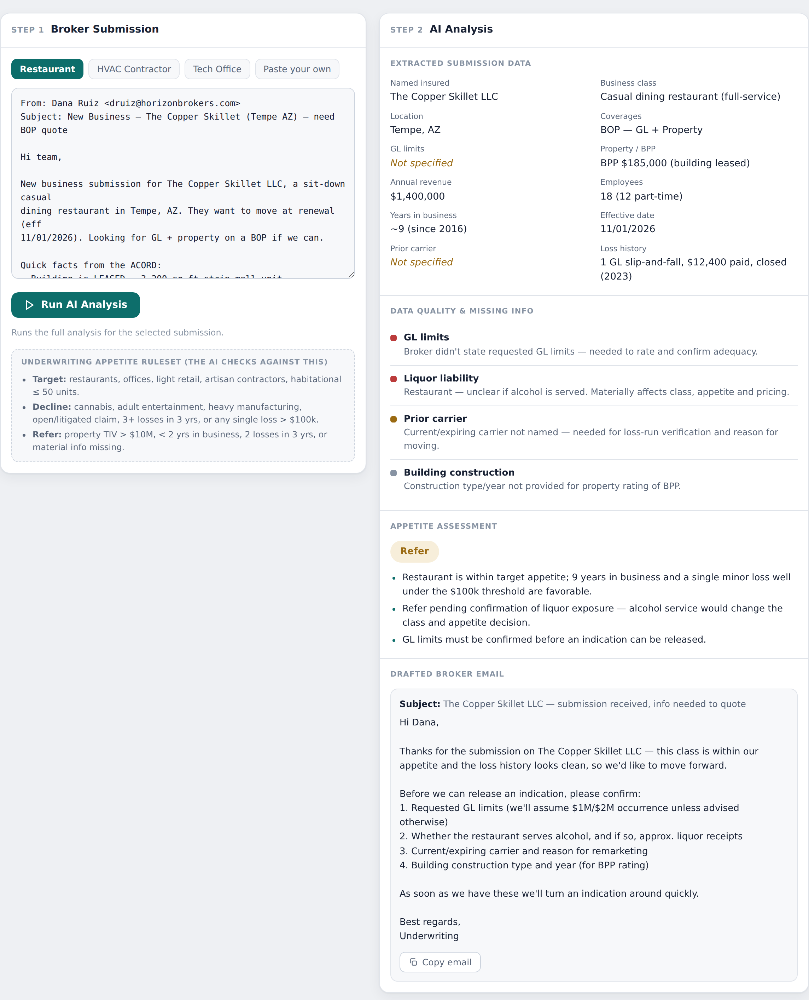

# SubmissionIQ — AI Underwriting Submission Assistant

Commercial insurance submission intake is one of the most manual steps in the business — an underwriting assistant reads a broker's email, ACORD forms and loss runs, re-keys the data, checks it against appetite, and writes back to the broker. **SubmissionIQ** shows how a large language model can do the first pass in seconds.

Paste a messy broker submission (or pick a sample) and SubmissionIQ:

1. **Extracts** the structured data — named insured, class, coverages, limits, TIV/BPP, revenue, years in business, loss history.
2. **Flags** missing or incomplete information, with a severity on each gap.
3. **Scores** the risk against an explicit, visible underwriting **appetite ruleset** (In Appetite / Refer to Underwriter / Decline, with reasons).
4. **Drafts** the underwriter's response email back to the broker.

**▶ Live demo:** https://YOUR-USERNAME.github.io/submissioniq/



---

## Why it's built this way (the BA view)

This is a business-analysis project as much as a technical one. The design decisions that matter:

- **The appetite ruleset is on the page, not hidden in the model.** Underwriting logic stays owned and auditable by the business; the AI just applies it consistently. That's the difference between a tool underwriters trust and one they don't.
- **A strict output contract.** The model returns a defined JSON shape (extracted fields, gaps, appetite verdict + reasons, draft email) so the output is predictable and renderable, not free text.
- **Real domain grounding.** ACORD intake, loss runs, TIV, occurrence limits, EMR, liquor-liability and subcontractor exposures — the kinds of details that decide a real submission.

**Target impact (estimated, not yet measured):** turns ~20–30 minutes of manual intake triage into under a minute, standardizes the appetite decision, and puts a clean, complete risk in front of the underwriter — or a drafted info request back to the broker — on first touch.

## How it works

```
Broker submission → extract → flag gaps → appetite check → drafted response
```

A single-page web app. The analysis runs a structured LLM call with the appetite ruleset embedded in the prompt and a JSON output contract, then renders the result into an underwriting console. Requirements, data model, prompt design, and acceptance criteria were defined as a BA deliverable.

This hosted version walks through three worked sample submissions end to end, one for each verdict: a restaurant (Refer to Underwriter), an artisan HVAC contractor (Decline) and a tech-firm office package (In Appetite). The analyses are pre-generated; the hosted page replays them and does not call a model live. A live-API build — where the model analyzes any pasted submission in real time via a serverless backend — is the natural next iteration.

## BA deliverables

The requirements, output contract, appetite decision table, acceptance criteria and evaluation plan are in [docs/BA-SPEC.md](docs/BA-SPEC.md).

## Tech

Plain HTML/CSS/JavaScript, no build step, no dependencies. Theme-aware (light/dark), responsive, and hosted free on GitHub Pages.

---

*Demonstration project using fictional companies and sample data. Not affiliated with any insurer; appetite logic is illustrative.*

**Built by Siddharth Waghmare** — business analyst, P&C insurance technology
[linkedin.com/in/siddharthwaghmare](https://www.linkedin.com/in/siddharthwaghmare)
